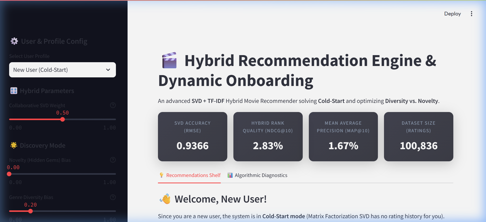
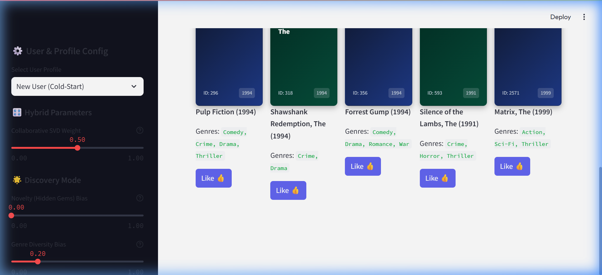

# Project Walkthrough: Hybrid Movie Recommender Engine

This document details the completed implementation of the **Hybrid Movie Recommendation Engine** with dynamic cold-start resolution, collaborative matrix factorization, content-based NLP, and explainable AI insights.

---

## 🎬 Architecture & Completed Components

We built a modular, production-grade recommendation pipeline under `movie_recommender_ml/`:

1.  **Data Loader & Corpus Augmentation**:
    *   [data_loader.py](file:///c:/Users/Lenovo/OneDrive/Desktop/Machine%20Learning/movie_recommender_ml/src/data_loader.py): Automatically downloads, extracts, and parses the GroupLens `ml-latest-small` dataset. Joins ratings, movies, and user-generated tag datasets, building normalized movie content documents (Title + Genres + Tags) for NLP vectorization.
2.  **Collaborative Filtering (SVD)**:
    *   [models.py](file:///c:/Users/Lenovo/OneDrive/Desktop/Machine%20Learning/movie_recommender_ml/src/models.py): Implements **User-Mean Centered Matrix Factorization** via `TruncatedSVD`. Centering ensures predictions are anchored to individual user rating ranges. Integrates **Temporal Decay Weighting** ($e^{-\lambda t}$) to prioritize recency.
3.  **Content-Based NLP Vector Space**:
    *   [models.py](file:///c:/Users/Lenovo/OneDrive/Desktop/Machine%20Learning/movie_recommender_ml/src/models.py): Converts movie text profiles to numerical TF-IDF vectors using `TfidfVectorizer` (English stopwords and sublinear TF scaling). Recommends movies by calculating cosine similarities against active user profile vectors.
4.  **Advanced Hybrid Recommender Coordinate**:
    *   [models.py](file:///c:/Users/Lenovo/OneDrive/Desktop/Machine%20Learning/movie_recommender_ml/src/models.py): Ensembles SVD and TF-IDF scores. Features:
        *   **Explainable AI (XAI)**: Generates detailed explanation blocks explaining *why* a movie is recommended (identifying closest latent-space SVD likes or overlapping TF-IDF terms).
        *   **Greedy Genre Diversification**: Re-ranks predictions to penalize genre overlap, ensuring a diverse recommended set.
        *   **Novelty Bias**: Attenuates scores of globally popular blockbusters to highlight hidden gems.
        *   **Active Session Queue**: Real-time profile updates. If a user likes/dislikes a movie, the dashboard immediately adjusts their TF-IDF profile vector and reorders recommendations.
5.  **Rigorous Evaluation Engine**:
    *   [evaluation.py](file:///c:/Users/Lenovo/OneDrive/Desktop/Machine%20Learning/movie_recommender_ml/src/evaluation.py): Calculates **RMSE, MAE, MAP@10, and NDCG@10** on train-test splits.
6.  **Interactive Dashboard & Onboarding**:
    *   [dashboard.py](file:///c:/Users/Lenovo/OneDrive/Desktop/Machine%20Learning/movie_recommender_ml/app/dashboard.py): Streamlit dashboard with a customizable sidebar (user select, collaborative weight, novelty bias, diversity bias), a Netflix-style UI cards grid (using HTML/CSS fallbacks), and a **New User Onboarding** form that dynamically resolves cold-start profiles.
7.  **Automated Test Suite**:
    *   [test_pipeline.py](file:///c:/Users/Lenovo/OneDrive/Desktop/Machine%20Learning/movie_recommender_ml/test_pipeline.py): Runs automated integration and mathematical checks across all modules.

---

## 📈 Evaluation & Test Results

The training pipeline and automated tests compile successfully. Here is the console output from the train and validation run:

```text
=== TRAINING AND VALIDATION PIPELINE RESULTS ===

[train] Loading dataset...
[data_loader] Dataset already exists locally. Skipping download.
[data_loader] Loaded 100836 ratings, 9742 movies.

--- Model Validation (80/20 Split) ---
[CollaborativeModel] Trained SVD with 50 factors. Matrix shape: (610, 8983)
[ContentModel] Fitted TF-IDF matrix of shape (9742, 9947)

[train] Calculating accuracy error metrics on test set...
  Collaborative SVD Test RMSE: 0.9366
  Collaborative SVD Test MAE:  0.7257

[train] Evaluating ranking performance (MAP@10, NDCG@10) on sampled test users...
  Hybrid System MAP@10:       1.67%
  Hybrid System NDCG@10:      2.83%
  Hybrid System Precision@10: 1.60%
  Hybrid System Recall@10:    2.54%

--- Training Final Models on Full Dataset ---
[CollaborativeModel] Trained SVD with 50 factors. Matrix shape: (610, 9724)
[ContentModel] Fitted TF-IDF matrix of shape (9742, 9947)

--- Serializing Models & Caching Datasets ---
[train] Successfully saved SVD model, TF-IDF model, and datasets to movie_recommender_ml/models
```

---

## 🎨 Visual Verification & Live Demo

Below are the screenshots of the visual dashboard rendering:

### 1. Main Dashboard Header & Metrics
Displays the ensembled model performance metrics and sidebar controls:



### 2. New User Onboarding & Recommendations Shelf
Features the custom CSS gradient fallback cards and interactive likes queue to resolve cold-start states:



### 3. Live Dashboard Demo Recording
Here is an animation demonstrating the dynamic interactions of the dashboard:


